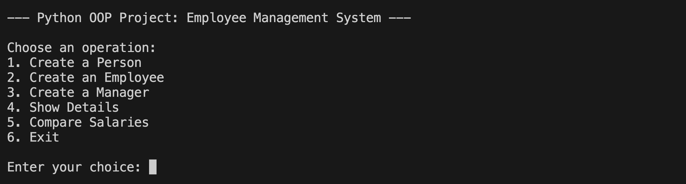
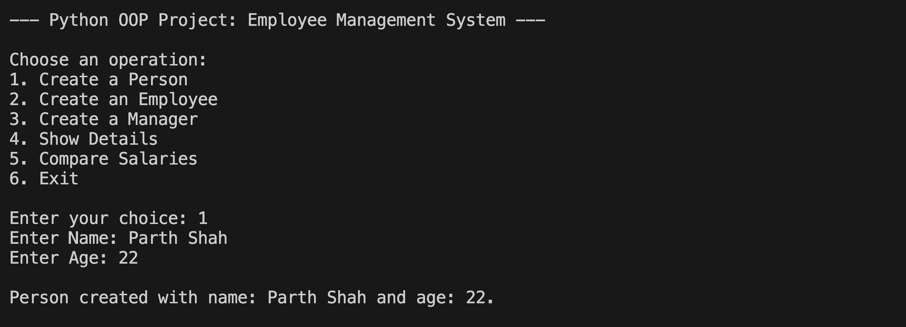
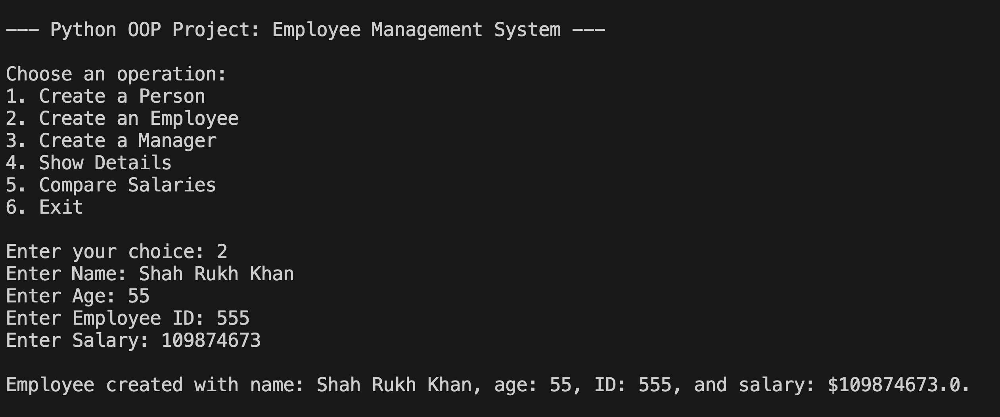
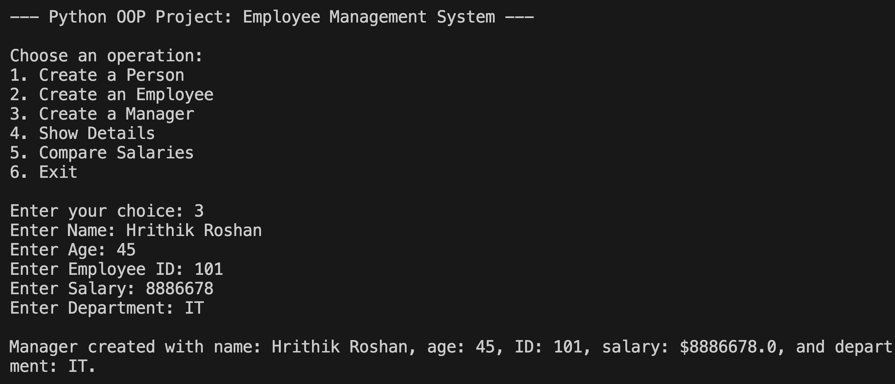
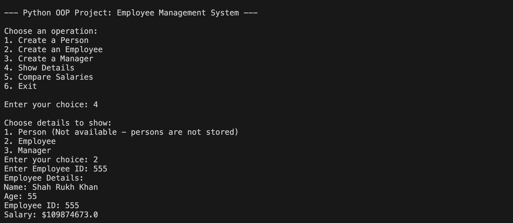
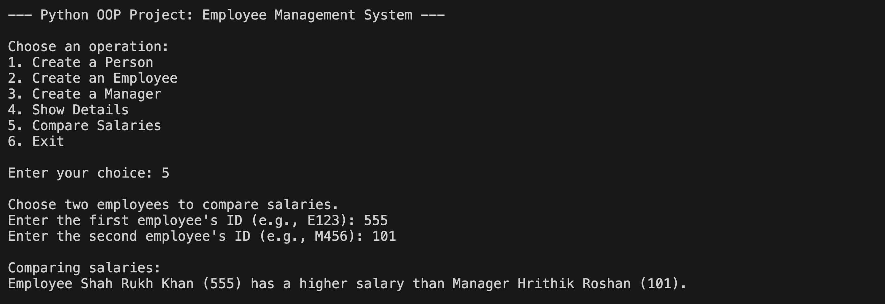
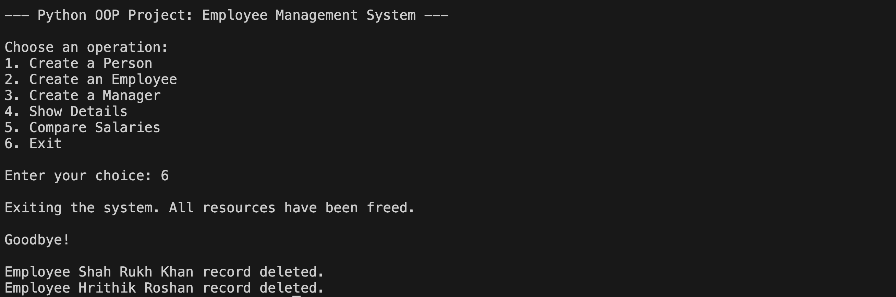

# 📦 OOP Wrapper — Employee Management System

> 🚀 \*"Where Python meets Professionalism — Architected by Parth Shah."

Welcome to **OOP Wrapper** — a meticulously designed, fully Object-Oriented Employee Management System built in **pure Python**. This project showcases the power and elegance of Python's OOP capabilities through real-world modelling of Employees, Managers, and Developers.

Whether you're a fellow student, an educator, or a curious developer, you're about to dive into a system that goes beyond the classroom to explore best practices in encapsulation, inheritance, method overloading/overriding, operator overloading, and much more.

---

## 🧭 Table of Contents

- [📦 Project Overview](#-project-overview)
- [🧠 Behind the Code](#-behind-the-code)
- [✨ Features](#-features)
- [🧪 Tech Stack](#-tech-stack)
- [📊 How It Works](#-how-it-works)
- [📁 Folder Structure](#-folder-structure)
- [⚙️ Setup & Run](#️-setup--run)
- [💬 FAQs](#-faqs)
- [🖼 Image Upload Guide (For Mac + VS Code)](#-image-upload-guide-for-mac--vs-code)
- [❤️ Final Note](#-final-note)

---

## 📦 Project Overview

> **Objective:** To build a robust, menu-driven Employee Management System using core Object-Oriented Programming (OOP) principles.

### 💼 Roles Modeled:

- 👨‍💼 **Employee** — base class with core attributes like name, age, employee\_id, salary
- 🧑‍💼 **Manager** — inherits from Employee, adds `department`
- 👨‍💻 **Developer** — inherits from Employee, adds `programming_language`

### 🧩 OOP Concepts Implemented:

- Classes & Objects
- Inheritance & Method Overriding
- Method Overloading via constructor variations
- Encapsulation with getter/setter methods
- Operator Overloading (`__eq__`, `__lt__`, `__gt__`)
- `super()` and `issubclass()` usage
- `__str__` and destructor (`__del__`) methods

---

## 🧠 Behind the Code

Every class in this project was designed not just for functionality, but to teach.

- The ``** class** encapsulates sensitive attributes and offers controlled access.
- **Inheritance** enables `Manager` and `Developer` to build on `Employee`, encouraging DRY (Don't Repeat Yourself) coding.
- **Method Overloading** is shown through constructor flexibility.
- By overriding the `display()` method, **polymorphism** comes to life in the simplest way.
- Operator Overloading is applied to compare employees by salary, making the objects smarter and the code cleaner.

A dictionary structure stores employees in-memory for quick access and demonstrations.

---

## ✨ Features

- ✅ Clean separation of classes for Employee, Manager, Developer
- 🔐 Private attributes with full encapsulation via getter/setter
- 🔁 Menu-driven interface for real-time interaction
- 📉 Compare salaries using overloaded operators (`==`, `<`, `>`)
- 🧼 Destructor logs object cleanup
- 🧠 Smart use of `super()` to reduce redundancy
- 🧪 Supports `issubclass()` checks for class validation
- 👨‍💻 Written in pure Python — no external libraries!

---

## 🧪 Tech Stack

| Language | Framework | Interface | Version        |
| -------- | --------- | --------- | -------------- |
|          | None      | CLI       | 🐍 Pure Python |

---

## 📊 How It Works

The program opens with a menu like this:

```
--- Python OOP Project: Employee Management System ---

1. Create a Person
2. Create an Employee
3. Create a Manager
4. Show Details
5. Compare Salaries
6. Exit
```

### 🖼 Sample Screenshots

> Add these screenshots inside an `images/` folder and use:











---

## 📁 Folder Structure

```
OOP-Wrapper/
├── main.py
├── images/
│   ├── demo1.png
│   ├── demo2.png
│   └── demo3.png
└── README.md
```

---

## ⚙️ Setup & Run

> 🔧 No dependencies — just Python!

### 🧾 Requirements

- Python 3.10 or above

### ▶️ Running the Program

```bash
python3 main.py
```

You’ll be greeted with a beautiful CLI interface to interact with employee records.

---

## 💬 FAQs

The system checks if the ID exists in the dictionary. If not, it shows an appropriate error.

Yes! Operator overloading allows any two `Employee` objects (Manager/Developer included) to be compared by salary.

No — data is stored in-memory using a Python dictionary for simplicity.

---

## 🖼 Image Upload Guide (For Mac + VS Code)

To include screenshots in your README:

1. 🗂 Create a folder named `images` in the root directory of your project.
2. 🖼 Add your `.png` or `.jpg` screenshots to this folder.
3. 🧩 Use Markdown syntax to embed them:

```markdown

```

4. ✅ Recommended naming: `demo1.png`, `demo2.png`, `result1.png` for clarity and order.

---

## ❤️ Final Note

This project was built with passion and precision by **Parth Shah** — a rising developer who believes in clean code, real-world logic, and the beauty of Python’s OOP.

🌟 **Star this repo** if you found it useful. 📣 **Share it** with friends exploring OOP. 🤝 **Let’s connect** — greatness begins with collaboration.

> **"Code not just for completion, but for comprehension."**

---

